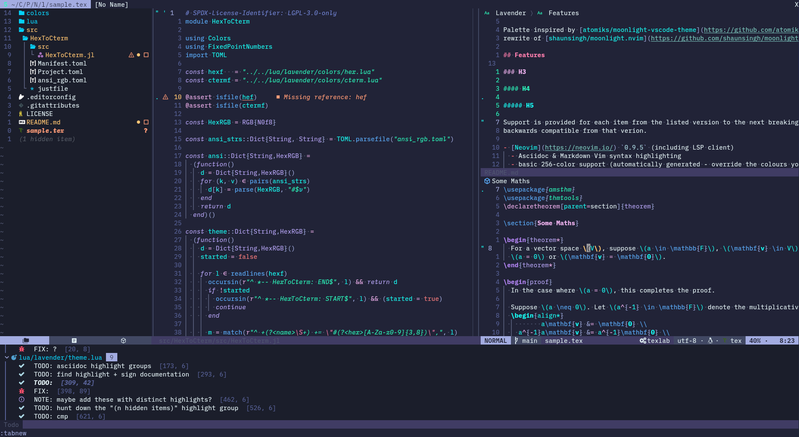
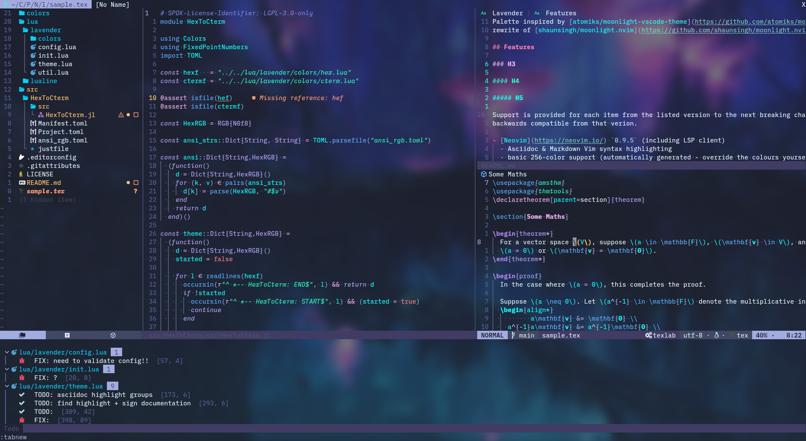

<!-- SPDX-License-Identifier: LGPL-3.0-only -->
# Lavender

Canonical: <https://codeberg.org/jthvai/lavender.nvim><br />
Mirror: <https://forge.jthv.ai/elias/lavender.nvim>

Purple-hued dark mode colorscheme for [Neovim](https://neovim.io/).



[^wallpaper]

[^wallpaper]: Taken with [swayfx](https://github.com/WillPower3309/swayfx) with default blur settings; **WALLPAPER AND
  COMPOSITOR NOT INCLUDED** - though you can find this specific wallpaper
  [here](https://web.archive.org/web/20240507050312/https://wallpapercave.com/wp/wp6332617.jpg)
  (I tweaked the brightness for this screenshot).

Palette inspired by [atomiks/moonlight-vscode-theme](https://github.com/atomiks/moonlight-vscode-theme); a complete
rewrite of [shaunsingh/moonlight.nvim](https://github.com/shaunsingh/moonlight.nvim), which is no longer maintained.

## Features

Support is provided for each item from the listed version to the next breaking change, as well as whatever is
backwards compatible from that version.

- [Neovim](https://neovim.io/) `0.10.0` (including LSP client)
  - Asciidoc & Markdown Vim syntax highlighting
  - basic 256-color support (automatically generated - override the colours yourself if you have issues)
- [nvim-treesitter/nvim-treesitter](https://github.com/nvim-treesitter/nvim-treesitter) `main @ f9773e4 (2024-06-01)`
- [nvim-lualine/lualine.nvim](https://github.com/nvim-lualine/lualine.nvim)

If something is wrong (particularly if highlights are missing[^inspect]) with one of these, please [submit an
issue](https://codeberg.org/jthvai/lavender.nvim/issues).

Several popular plugins are also supported. See [theme.lua](lua/lavender/theme.lua) (about midway through) for details.

In general, I am not too keen on providing tailored support for plugins that I don't use[^plugins], as I'm unlikely to
notice if something breaks or looks bad. **But!** It is really easy to extend this colorscheme - see
[Examples](#examples) below.

[^plugins]: [said plugins, and their config](https://forge.jthv.ai/elias/nvim-config/src/branch/main/lua/plugins/README.md)
[^inspect]: use `:Inspect` with your cursor over an element to inspect the syntax tokens - `:help :Inspect`

## Requirements

- [Neovim](https://neovim.io/) (same versions as in [Features](#features))
- [nvim-treesitter](https://github.com/nvim-treesitter/nvim-treesitter) (optional)
  - I strongly recommend installing treesitter, and parsers for your favourite languages, as I will not particularly
    ensure that Vim's native syntax highlighting looks good for languages where treesitter queries are available, except
    the ones explicitly stated in [Features](#features).
- _(Optional)_ a [patched font](https://www.nerdfonts.com/) for custom diagnostic signs
  (set `signs = true` in the config, `false` by default)

_Julia is **not** a runtime dependency._

## Installation

[lazy.nvim](https://github.com/folke/lazy.nvim):

```lua
{
  url = "https://codeberg.org/jthvai/lavender.nvim",
  branch = "stable", -- versioned tags + docs updates from main
  lazy = false,
  priority = 1000,
}
```

## Usage

```vim
" Vimscript
colorscheme lavender
```

```lua
-- Lua
vim.cmd "colorscheme lavender"
```

## Configuration

**WARNING**: Do not call `require("lavender").setup()` — it does not exist, and is not used to configure this
plugin[^setup].

Add `vim.g.lavender` to `init.lua` or wherever else global variables may be set in lua[^vimscript], _e.g._ lazy.nvim's
`config` function. Do this before calling `:colorscheme lavender`.

```lua
-- Default config in lua
vim.g.lavender = {
  transparent = {
    background = false, -- do not render the main background
    float      = false, -- do not render the background in floating windows
    popup      = false, -- do not render the background in popup menus
    sidebar    = false, -- do not render the background in sidebars
  },
  contrast = true, -- colour the sidebar and floating windows differently to the main background

  signs = false, -- use icon (patched font) diagnostic sign text

  -- new values will be merged in
  overrides = {
    -- highlight groups - see theme.lua
    -- existing groups will be entirely replaced
    theme = {},

    colors = {
      cterm = {}, -- cterm colours - see colors/cterm.lua
      hex = {}, -- hex (true) colours - see colors/hex.lua
    },
  },
}
```

Custom hex colours are not mapped to 256-color on the fly for performance reasons.

[^setup]: I took [advice](https://mrcjkb.dev/posts/2023-08-22-setup.html) on config design from
  [@mrcjkb](https://github.com/mrcjkb), developer of
  [haskell-tools.nvim](https://github.com/mrcjkb/haskell-tools.nvim).
[^vimscript]: You could _probably_ do it in vimscript if you really wanted to, but I don't know how and certainly
  couldn't tell you.

### Examples

```lua
vim.g.lavender = {
  overrides = {
    theme = {
      NormalFoo = { fg = "fg", bg = "purple3", bold = true }, -- add a new highlight group using lavender's colours
      NormalBar = { fg = "Red", bg = "#303030", ctermfg = 196, ctermbg = 236 }, -- using colours directly
      NormalBaz = { fg = "custom_red", ctermfg = "custom_blue" }, -- using colours added in colour overrides below
      -- lavender's colours are lowercase, while nvim's internal colour names are PascalCase

      Normal = { fg = "white", bg = "bg_alt", ctermfg = "white", ctermbg = "bg_alt" }, -- override a highlight group
      -- overriding existing highlight groups will replace the entire definition
    },
    colors = {
      hex = {
        custom_red = "#ff3300", -- add a new colour; this can now be used in any highlight group
      },
      cterm = {
        custom_blue = 33,
      },
    },
  },
}
```

## Palette

| <!-- -->                                                  | <!-- -->                                                  |
| ---                                                       | ---                                                       |
| `#1b1c2b`  | `#b4a4f4`  |
| `#1b1e2b`  | `#b994f1`  |
| `#212337`  | `#ad82ed`  |
| `#403c64`  | `#ecb2f0`  |
| `#414863`  | `#f77eae`  |
| `#515772`  | `#ff5370`  |
| `#596399`  | `#ff757f`  |
| `#7486d6`  | `#f67f81`  |
| `#757dac`  | `#ff9e7b`  |
| `#a19bb5`  | `#ffc777`  |
| `#a1abe0`  | `#add8e6`  |
| `#a3ace1`  | `#80cbc4`  |
| `#d6e7f0`  | `#59d6b5`  |
| `#e4f3fa`  | `#2df4c0`  |
| `#eeffff`  | `#04d1f9`  |
|                                                           | `#5fafff`  |

## License

Copyright 2024 Elias Elwyn <a@jthv.ai>, [GNU LGPL v3.0 only](./LICENSE).

```txt
This program is free software: you can redistribute it and/or modify it
under the terms of the GNU Lesser General Public License, version 3 only, as
published by the Free Software Foundation.

This program is distributed in the hope that it will be useful, but WITHOUT
ANY WARRANTY; without even the implied warranty of MERCHANTABILITY or
FITNESS FOR A PARTICULAR PURPOSE. See the GNU Lesser General Public License
for more details.

You should have received a copy of the GNU Lesser General Public License
along with this program. If not, see <https://www.gnu.org/licenses/>.
```

### Acknowledgements

- [atomiks/moonlight-vscode-theme](https://github.com/atomiks/moonlight-vscode-theme) for the aesthetic,
  [MIT License](https://github.com/atomiks/moonlight-vscode-theme/blob/master/LICENSE)
- [shaunsingh/moonlight.nvim](https://github.com/shaunsingh/moonlight.nvim) for the initial Neovim port of Moonlight,
  [GNU GPL v2.0](https://github.com/shaunsingh/moonlight.nvim/blob/pure-lua/LICENSE)
- [folke/tokyonight.nvim](https://github.com/folke/tokyonight.nvim) for the up-to-date highlight groups and plugin
  structure, [Apache License, Version 2.0](https://github.com/folke/tokyonight.nvim/blob/main/LICENSE)
